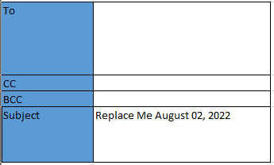
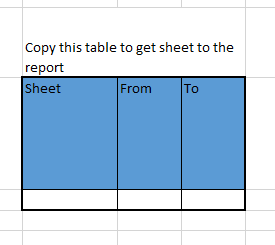

# OutlookReportMacro
Excel macro to create an Outlook email that collects information in the 
same worksheet.

Credit to Ron de Bruin for rangetohtml converter

### How to enable developer tab in Excel

(https://support.microsoft.com/en-au/topic/show-the-developer-tab-e1192344-5e56-4d45-931b-e5fd9bea2d45)

## How to use
Add recipient

Subject line has current day after it. Change the container here

To add information from other sheet, copy below table to A column 

Dont but anything else in A column